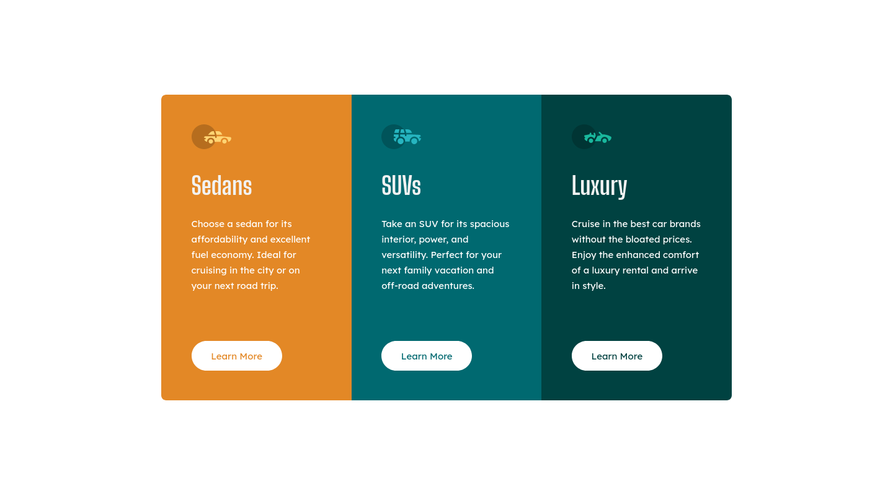

# Frontend Mentor - 3-column preview card component solution

This is a solution to the [3-column preview card component challenge on Frontend Mentor](https://www.frontendmentor.io/challenges/3column-preview-card-component-pH92eAR2-). Frontend Mentor challenges help you improve your coding skills by building realistic projects. 

## Table of contents

- [Overview](#overview)
  - [The challenge](#the-challenge)
  - [Screenshot](#screenshot)
  - [Links](#links)
- [My process](#my-process)
  - [Built with](#built-with)
  - [What I learned](#what-i-learned)
  - [Continued development](#continued-development)
- [Author](#author)
- [Acknowledgments](#acknowledgments)

**Note: Delete this note and update the table of contents based on what sections you keep.**

## Overview

### The challenge

Users should be able to:

- View the optimal layout depending on their device's screen size
- See hover states for interactive elements

### Screenshot

### Links

- Solution URL: 
- Live Site URL: 

## My process

### Built with

- Semantic HTML5 markup
- CSS custom properties
- Flexbox
- CSS Grid
- fluid containers

### What I learned

This project was relatively straighforward, nothing too crazy, just a component. However, as I was trying to implement fluid containers it still got a bit difficult. When you make the contianer containging the image fluid, using precentage, it will grow out too quickly compared to other elements like text. In the following projects I'll try to watch out for this occurence and make everything scale proportionatly.

### Continued development

Continue the use of fluid containers and trying to scale its content accordingly. 

## Author

- Frontend Mentor - [@justinvanre](https://www.frontendmentor.io/profile/justinvanre)

## Acknowledgments

This project didn't ask for the use of fluid containers that much but, I still want to mention the book that gave me some insights into fluid containers as part of responsive grids.

see link to book: [Responsive web design](https://abookapart.com/products/responsive-web-design)
