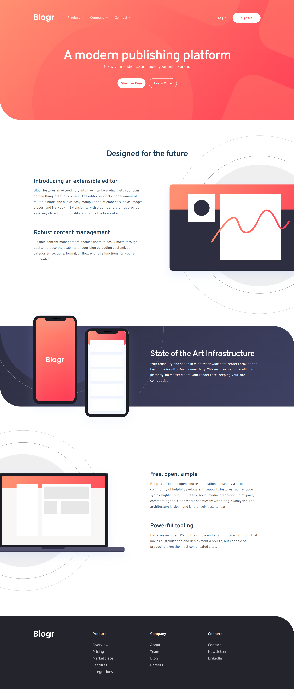

# Frontend Mentor - Blogr landing page solution

This is a solution to the [Blogr landing page challenge on Frontend Mentor](https://www.frontendmentor.io/challenges/blogr-landing-page-EX2RLAApP). Frontend Mentor challenges help you improve your coding skills by building realistic projects. 

## Table of contents

- [Overview](#overview)
  - [The challenge](#the-challenge)
  - [Screenshot](#screenshot)
  - [Links](#links)
- [My process](#my-process)
  - [Built with](#built-with)
  - [What I learned](#what-i-learned)
- [Author](#author)

## Overview

### The challenge

Users should be able to:

- View the optimal layout for the site depending on their device's screen size
- See hover states for all interactive elements on the page

### Screenshot

### Links

- Solution URL: [repo](https://github.com/justinvanre/frontend-mentor-projects/tree/main/blogr-landing-page-main)
- Live Site URL: [site](https://justinvanre.github.io/frontend-mentor-projects/blogr-landing-page-main/)

## My process

### Built with

- Semantic HTML5 markup
- CSS custom properties
- Flexbox
- CSS Grid
- Mobile-first workflow

### What I learned

Welcome to my solution to the Blogr landing page. I have to say this one was tough due to the use of position and the many times a style changes based on desktop or mobile. It was also hard to name sections, especially the menu component, as it required multiple double contianer patterns. The same goes for other parts. That said, it was a fun and educational, and I will take a lot of lessons learned with me in future projects.

I've said it multiple times now. I  have to learn and use sass to make my code more readable and accessible because, as seen in this project, the more I write code there is more need for organization, even though I made use of the bem method.

Before I start another big project, I will first learn how I could apply sass.

## Author

- Frontend Mentor - [@yourusername](https://www.frontendmentor.io/profile/justinvanre)

