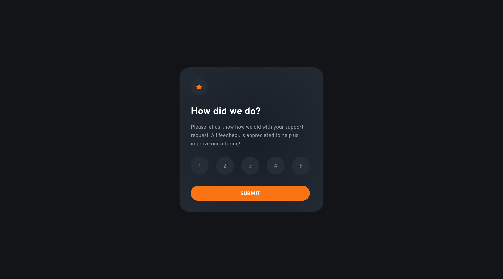

# Frontend Mentor - Interactive rating component solution

This is a solution to the [Interactive rating component challenge on Frontend Mentor](https://www.frontendmentor.io/challenges/interactive-rating-component-koxpeBUmI). Frontend Mentor challenges help you improve your coding skills by building realistic projects. 

## Table of contents

- [Overview](#overview)
  - [The challenge](#the-challenge)
  - [Screenshot](#screenshot)
  - [Links](#links)
- [My process](#my-process)
  - [Built with](#built-with)
  - [What I learned](#what-i-learned)
  - [Continued development](#continued-development)
- [Author](#author)

## Overview

### The challenge

Users should be able to:

- View the optimal layout for the app depending on their device's screen size
- See hover states for all interactive elements on the page
- Select and submit a number rating
- See the "Thank you" card state after submitting a rating

### Screenshot

### Links

- Solution URL: [Add solution URL here](https://your-solution-url.com)
- Live Site URL: [Add live site URL here](https://your-live-site-url.com)

## My process

### Built with

- Flexbox
- Mobile-first workflow
- Vanilla Js

### What I learned

I had so fun building this project. It was challeging but straightforward, and I got to work with the dom for the first time, which was quite educational. However, I had some difficulty preventing too much of overriding code. I realized I need to pick one magnification factor and change the font size on different screensizes, allowing the component to scale down or up accordingly instead of rewriting the magnification factor every time. 

### Continued development

use the magnification factor based on the design of one screensize.

## Author

- Frontend Mentor - [@justinvanre](https://www.frontendmentor.io/profile/justinvanre)
