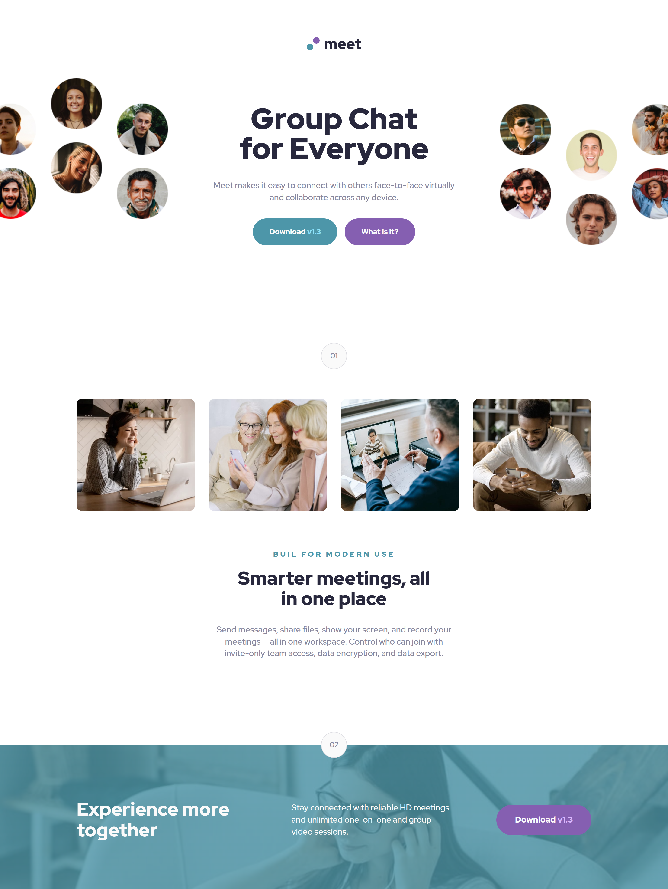

# Frontend Mentor - Meet landing page solution

This is a solution to the [Meet landing page challenge on Frontend Mentor](https://www.frontendmentor.io/challenges/meet-landing-page-rbTDS6OUR). Frontend Mentor challenges help you improve your coding skills by building realistic projects. 

## Table of contents

- [Overview](#overview)
  - [The challenge](#the-challenge)
  - [Screenshot](#screenshot)
  - [Links](#links)
- [My process](#my-process)
  - [Built with](#built-with)
  - [What I learned](#what-i-learned)
  - [Continued development](#continued-development)
- [Author](#author)

## Overview

### The challenge

Users should be able to:

- View the optimal layout depending on their device's screen size
- See hover states for interactive elements

### Screenshot

### Links

- Solution URL: [repository](https://github.com/justinvanre/frontend-mentor-projects/tree/main/meet-landing-page)
- Live Site URL: [site](https://justinvanre.github.io/frontend-mentor-projects/meet-landing-page/)

## My process

### Built with

- Semantic HTML5 markup
- CSS custom properties
- Flexbox
- CSS Grid
- BEM method
- Mobile-first workflow

### What I learned

With this challenge I learned how messy it can get if you build a full-page with various components. I was a little uncomfortable at first. However, I tried to focus on them seperately and iterate through the process. It was also tedious once the body font size changed, and I had to change the margins. I assume that's part of the job when trying to make it match the different designs. However, in a real life projects we can try to stick to one proportion if possible and suitable.

### Continued development

As for continued development, I want to emphasise on organizing code and dive into SASS.

## Author

- Frontend Mentor - [@yourusername](https://www.frontendmentor.io/profile/justinvanre)

